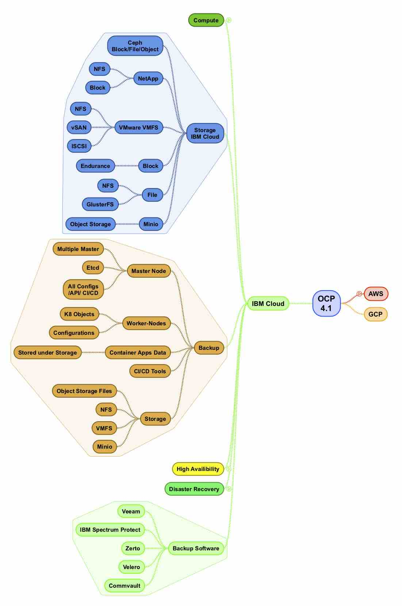
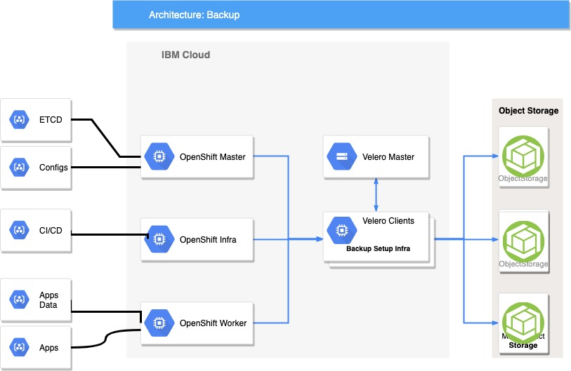
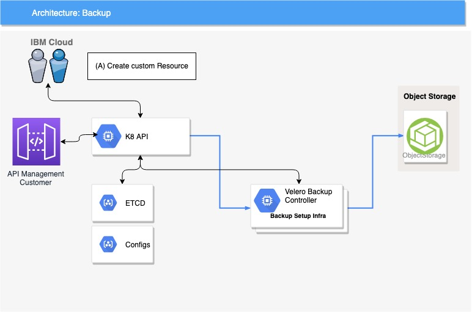

## OpenShift Reference Storage and backup Solution for IBM Cloud
### -Dwarkanath P Rao

### Table of Content
******************************************************************************************************************************

[OpenShift Reference Storage and backup Solution for IBM Cloud
3](#openshift-reference-storage-and-backup-solution-for-ibm-cloud)

[1. Storage on IBM Cloud 4](#storage-on-ibm-cloud)

[1.1. Block storage 4](#block-storage)

[1.1.1. Ceph Storage as Block 4](#ceph-storage-as-block)

[1.2. File Storage: NFS 4](#file-storage-nfs)

[1.2.1. GlusterFS 4](#glusterfs)

[1.2.2. Ceph as File on Endurance storage5](#ceph-as-file-on-endurance-storage)

[1.3. IBM Object Storage or Minio Storage( Dedicated on Cloud\|).
5](#ibm-object-storage-or-minio-storage-dedicated-on-cloud.)

[1.3.1. Object Storage from IBM Cloud 5](#object-storage-from-ibm-cloud)

[1.3.2. Minio Storage for Dedicated customers
5](#minio-storage-for-dedicated-customers)

[1.3.3. Ceph as ObjectStorage 5](#ceph-as-objectstorage)

[1.4. NetApp OnTap Storage 5](#netapp-ontap-storage)

[1.4.1. NFS andBlock Storage on NetApp On tap
5](#nfs-andblock-storage-on-netapp-on-tap)

[1.5. VMware vSphere File System 5](#vmware-vsphere-file-system)

[1.5.1. File Systeme on VMware 6](#file-systeme-on-vmware)

[1.5.2. Additional Information 6](#additional-information)

[2. Backup on IBM Cloud 6](#backup-on-ibm-cloud)

[2.1. OpenShift Architecture for Master and Infra Components
7](#openshift-architecture-for-master-and-infra-components)

[2.2. Master Nodes 7](#master-nodes)

[2.3. Restore Master node using backup on OCP
7](#restore-master-node-using-backup-on-ocp)

[2.4. Etcd 8](#etcd)

[2.5. CI/CD and Tools backup and configuration
8](#cicd-and-tools-backup-and-configuration)

[2.6. IPAM/AD/DNS/DHCP backup and SFTP setup.
8](#ipamaddnsdhcp-backup-and-sftp-setup.)

[2.7. Worker nodes 8](#worker-nodes)

[2.8. Backing up registry certificates 8](#_Toc13503689)

[2.9. Backing up application data 8](#backing-up-application-data)

[2.10. Restore OCP environment 8](#restore-ocp-environment)

[2.10.1. Recovering from lost master hosts
8](#recovering-from-lost-master-hosts)

[2.10.2. Restoring back to a previous cluster state
9](#restoring-back-to-a-previous-cluster-state)

[2.11. Container application data 9](#container-application-data)

[2.11.1. Backup of the data though Velero
9](#backup-of-the-data-though-velero)

[2.11.2. Restore the data back for containers
9](#restore-the-data-back-for-containers)

[3. Backup Software 9](#backup-software)

[3.1. Velero 9](#velero)

[3.1.1. Why is backup critical on Kubernetes
9](#why-is-backup-critical-on-kubernetes)

[3.1.2. What are important components for backup
9](#what-are-important-components-for-backup)

[3.2. Velero Architecture 10](#velero-architecture)

[3.2.1. Prerequisites 10](#prerequisites)

[3.2.2. Restic Plugin 10](#restic-plugin)

[3.2.3. Restic along with Velero 10](#restic-along-with-velero)

[3.2.3.1. Restic Repository 10](#restic-repository)

[3.2.3.2. PodVolumeBackup 10](#podvolumebackup)

[3.2.3.3. PodVolumeRestore 11](#podvolumerestore)

[3.3. Velero and Backup for Multi Cloud environment
11](#velero-and-backup-for-multi-cloud-environment)

[3.4. Backup Schedule 11](#backup-schedule)

[3.4.1. Backups on Demand 11](#backups-on-demand)

[3.4.2. Scheduled backups 11](#scheduled-backups)

[3.5. Restores 12](#restores)

[3.6. Backup workflow 12](#backup-workflow)

[4. Backup Storage 12](#backup-storage)

[4.1. IBM Cloud Object Storage as backup storage
12](#ibm-cloud-object-storage-as-backup-storage)

[4.1.1. IBM Cloud Object Storage as Velero’s storage destination.
12](#ibm-cloud-object-storage-as-veleros-storage-destination.)

[4.1.2. Create COS instance 12](#create-cos-instance)

[4.1.3. Create an S3 bucket 12](#create-an-s3-bucket)

[4.2. Minio (Dedicated Object Storage)
13](#minio-dedicated-object-storage)

[4.2.1. Minio Overview 13](#minio-overview)

[4.2.2. Architecture 13](#architecture)

[4.2.3. Minio Object Storage Architecture
14](#minio-object-storage-architecture)

[4.2.4. Minio Server Modes 14](#minio-server-modes)

[4.2.5. Minio References and blogs 15](#minio-references-and-blogs)

The high level Mind Map analysis of Backup, Storage and flow for IBM
Cloud for OCP 4.1

Figure IBM Cloud Storage, Backup and Backup software walkthrough

## Storage on IBM Cloud

There are a number of different options that can be considered based on
the application requirements and business needs

<table>
<thead>
<tr class="header">
<th><strong>Storage Selection</strong></th>
<th><strong>Means to use it in container environment</strong></th>
<th><strong>Technology Options</strong></th>
</tr>
</thead>
<tbody>
<tr class="odd">
<td>Block</td>
<td><ul>
<li><blockquote>

Presented to the operating system (OS) as a block device

</blockquote></li>
<li><blockquote>

Suitable for applications that need full control of storage and operate at a low level on files bypassing the file system, referred as Storage Area Network (SAN)

</blockquote></li>
</ul></td>
<td>
Ceph RBD and VMware vSphere support dynamic persistent volume (PV).

Endurance Storage on IBM Cloud Natively used by OCP as block Storage PV.
</td>
</tr>
<tr class="even">
<td>File aka NFS</td>
<td><ul>
<li><blockquote>

Presented to the OS as a file system export to be mounted

</blockquote></li>
<li><blockquote>

Also referred to as Network Attached Storage (NAS)

</blockquote></li>
<li><blockquote>

Concurrency, latency, file locking mechanisms, and other capabilities vary widely between protocols, implementations, vendors, and scales.

</blockquote></li>
</ul></td>
<td>
NFS, NetApp NFS , Vendor NFS.

Endurance NFS on IBM Cloud
</td>
</tr>
<tr class="odd">
<td>
Object

Storage
</td>
<td><ul>
<li><blockquote>

Cloud Native application for container native apps and majority for backup of container apps data.

</blockquote></li>
</ul></td>
<td>Ceph Object Storage (RADOS Gateway) &amp; Minio Storage for Backup.</td>
</tr>
</tbody>
</table>

1.  ### Block storage

    1.  #### Ceph Storage as Block

-   OpenShift Container Platform clusters can be provisioned
    with [persistent
    storage](https://docs.openshift.com/container-platform/3.6/architecture/additional_concepts/storage.html#architecture-additional-concepts-storage) using
    Ceph RBD.

-   Persistent volumes (PVs) and [persistent volume claims
    (PVCs)](https://docs.openshift.com/container-platform/3.6/dev_guide/persistent_volumes.html#dev-guide-persistent-volumes) can
    share volumes across a single project. While the Ceph RBD-specific
    information contained in a PV definition could also be defined
    directly in a pod definition, doing so does not create the volume as
    a distinct cluster resource, making the volume more susceptible to
    conflicts.

-   [Persistent Storage Using Ceph Rados Block
    Device](https://docs.openshift.com/container-platform/3.6/install_config/persistent_storage/persistent_storage_ceph_rbd.html#install-config-persistent-storage-persistent-storage-ceph-rbd) provides
    an explanation of persistent volumes (PVs), persistent volume claims
    (PVCs), and how to use Ceph Rados Block Device (RBD) as persistent
    storage.

2.  ### File Storage: NFS

    1.  #### GlusterFS

> Moving ahead, RedHat Open shift will be moving away from Gluster FS
> from 4.2 onwards and recommendation is to utilize Ceph, and other
> options for file systems.

#### Ceph as File on Endurance storage 

> Ceph can be installed and configured as File on Endurance on File(
> NFS) storage.
>
> It must be configured to consume Ceph as File when presented to OCP
> environment. For further installation configuration on CoreOS refer to
> Ceph RHEL guide.

3.  ### IBM Object Storage or Minio Storage( Dedicated on Cloud\|).

    1.  #### Object Storage from IBM Cloud

> IBM Object Storage provides all the required features and capabilities
> to host the container platform for apps to store data and utilise this
> for using this as a long term backup. Kubernetes and OCP provides good
> implementation reference for configuring and implementing storage
> cluster for its consumption. These are available on the Red hat
> portal.

#### Minio Storage for Dedicated customers

> Look into the Section [Minio](#minio-dedicated-object-storage)

#### Ceph as ObjectStorage

> Ceph can be setup and configured as Object Storage also called as
> rados gateway for OpenShift Container Platform
>
> The link below provides information on the planning, design, sizing
> details for the Ceph implementation.
>
> [Link to Ceph on Object
> storage](https://access.redhat.com/documentation/en-us/red_hat_ceph_storage/3/html-single/ceph_object_gateway_for_production/index)

4.  ### NetApp OnTap Storage

    1.  #### NFS andBlock Storage on NetApp On tap

> NetApp Are available on IBM Cloud and can be ordered as needed, These
> can be configured as requirements are desired. Can be provisioned or
> NFS and Block

-   [NetApp On Tap Architecture
    Overview](https://www.ibm.com/cloud/garage/architectures/virtualizationArchitecture)

-   [NetApp On Tap
    Overview](https://cloud.ibm.com/docs/services/vmwaresolutions?topic=vmware-solutions-np_netappoverview#np_netappoverview-specs)

-   [IBM Cloud Availability across
    Region](https://cloud.ibm.com/docs/services/vmwaresolutions/netapp?topic=vmware-solutions-np_planning#requirements-and-planning-for-netapp-ontap-select-instances)

### VMware vSphere File System 

> OpenShift Container Platform supports VMware vSphere’s Virtual Machine
> Disk (VMDK) volumes. You can provision your OpenShift Container
> Platform cluster with [persistent
> storage](https://docs.openshift.com/container-platform/3.11/architecture/additional_concepts/storage.html#architecture-additional-concepts-storage) using [VMware
> vSphere](https://www.vmware.com/au/products/vsphere.html). Some
> familiarity with Kubernetes and VMware vSphere is assumed.
>
> OpenShift Container Platform creates the disk in vSphere and attaches
> the disk to the correct instance.
>
> The OpenShift Container Platform [persistent volume
> (PV)](https://docs.openshift.com/container-platform/3.11/architecture/additional_concepts/storage.html#architecture-additional-concepts-storage) framework
> allows administrators to provision a cluster with persistent storage
> and gives users a way to request those resources without having any
> knowledge of the underlying infrastructure. vSphere VMDK volumes can
> be [provisioned
> dynamically](https://docs.openshift.com/container-platform/3.11/install_config/persistent_storage/dynamically_provisioning_pvs.html#install-config-persistent-storage-dynamically-provisioning-pvs).
>
> PVs are not bound to a single project or namespace; they can be shared
> across the OpenShift Container Platform cluster. [PV
> claims](https://docs.openshift.com/container-platform/3.11/architecture/additional_concepts/storage.html#persistent-volume-claims),
> however, are specific to a project or namespace and can be requested
> by users.
>
> You can configure OpenShift Container Platform to use [VMware
> vSphere](https://www.vmware.com/au/products/vsphere.html) VMDKs as to
> back Persistent Volumes. This configuration can include [using VMware
> vSphere VMDKs as persistent
> storage](https://docs.openshift.com/container-platform/3.11/install_config/persistent_storage/persistent_storage_vsphere.html#install-config-persistent-storage-persistent-storage-vsphere) for
> application data.
>
> The vSphere Cloud Provider allows using vSphere-managed storage in
> OpenShift Container Platform and supports every storage primitive that
> Kubernetes uses:

-   Persistent Volume (PV)

-   PersistentVolumesClaim (PVC)

-   StorageClass

    1.  #### File Systeme on VMware

> PersistentVolumes requested by stateful containerized applications can
> be provisioned on VMware vSAN, VVOL, VMFS, or NFS datastores.
>
> Kubernetes PVs are defined in Pod specifications. They can reference
> VMDK files directly if you use Static Provisioning or PVCs when you
> use Dynamic Provisioning, which is preferred.
>
> The latest updates to the vSphere Cloud Provider are in [vSphere
> Storage for
> Kubernetes](https://vmware.github.io/vsphere-storage-for-kubernetes/documentation/index.html).

#### Additional Information

> [More Details are over
> here](https://docs.openshift.com/container-platform/4.1/installing/installing_vsphere/installing-vsphere.html)

## Backup on IBM Cloud

Figure Backup Architecture on IBM Cloud for OpenShift 4.1

1.  ### OpenShift Architecture for Master and Infra Components

2.  #### Master Nodes

> It is desirable to ensure that a full sized backup copy is available
> of the master node(s) as in all likely hood, this will be used for
> restoration in case of failure.
>
> Standard backup software can be used to achieve a Master node backup.
> It is recommended that once the master node in a restored etcd
> configurations which are backed up via backup commands and can be
> restored back, as this will hold the latest configurations of the OCP
> environment.
>
> Rest of the data can be restored once master nodes are restored, i.e.
> etcd, configmaps, LADP configurations, certificates, KMS or other
> security configurations and integrations with the shared services can
> be restored as required.
>
> Perform this backup process before any change to the OpenShift
> Container Platform infrastructure, such as a system update, upgrade,
> or any other significant modification. Back up data regularly to
> ensure that recent data is available if a failure occurs.
>
> **OpenShift Container Platform files**
>
> The master instances run important services, such as the API,
> controllers. The **/etc/origin/master** directory stores many
> important files:

-   The configuration, the API, controllers, services, and more

-   Certificates generated by the installation

-   All cloud provider-related configuration

-   Keys and other authentication files, such as **htpasswd** if you use
    > htpasswd

-   And more

> The configuration files are stored in
> the **/etc/sysconfig** directory.

#### Restore Master node using backup on OCP

> Creating a backup of a node host is a different use case from backing
> up a master host. Because master hosts contain many important files,
> creating a backup is highly recommended. However, the nature of nodes
> is that anything special is replicated over the nodes in case of
> failover, and they typically do not contain data that is necessary to
> run an environment. If a backup of a node contains something necessary
> to run an environment, then a creating a backup is recommended.
>
> The backup process is to be performed before any change to the
> infrastructure, such as a system update, upgrade, or any other
> significant modification. Backups should be performed on a regular
> basis to ensure the most recent data is available if a failure occurs.
>
> **OpenShift Container Platform files**
>
> Node instances run applications in the form of pods, which are based
> on containers.
> The **/etc/origin/** and **/etc/origin/node** directories house
> important files, such as:

-   The configuration of the node services

-   Certificates generated by the installation

-   Cloud provider-related configuration

-   Keys and other authentication files, such as
    > the **dnsmasq** configuration

> The OpenShift Container Platform services can be customized to
> increase the log level, use proxies, and more, and the configuration
> files are stored in the **/etc/sysconfig** directory.

#### Etcd

> Etcd which are in the master nodes of OCP can be accessed as the root
> user.
>
> Admins just have to run commands and take backup on Object Storage.
>
> Run the etcd-snapshot-backup.sh script and pass in the location to
> save the etcd snapshot to. $ sudo
> /usr/local/bin/etcd-snapshot-backup.sh ./assets/backup/snapshot.db

#### CI/CD and Tools backup and configuration

> List of tools which are getting installed on for CI/CD must follow the
> respective backup and restore techniques, majority of data will be
> captured by the stateful backup via traditional software and container
> data are captured via Velero.

#### IPAM/AD/DNS/DHCP backup and SFTP setup.

> This is normally out the scope of OCP based backup environment, but is
> recommended to follow backup and restore methods for AD, IPAM and
> other shared services.

#### Worker nodes

> The worker nodes doesn’t store or hold major data, hence a primary
> copy of the worker nodes should be reasonable. The container data and
> namespace, or projects detailed are backed up in the etcd, that will
> be allow admins to restore in case of failures or disaster.

#### Backing up application data

Establish Velero is installed and configured in the environment to
periodically take backup from the container file system which access
Velero Server to perform backup and write this to Object storage.

6.  #### Restore OCP environment

    1.  ##### Recovering from lost master hosts

> In a OCP environment OCP provides you the ability to recover from a
> complete loss of a master host. This is a use case where a most of
> master hosts have been lost, as of which the etcd quorum loss is
> visible and the cluster would go offline.
>
> At a high level, the procedure is to:  
> 1. Restore etcd quorum on a remaining master host.
>
> 2\. Create new master hosts.  
> 3. Correct DNS and load balancer entries.
>
> 4\. Grow etcd to full membership.
>
> If the majority of master hosts have been lost, you will need a backed
> up etcd snapshot to restore etcd quorum on the remaining master host.

##### Restoring back to a previous cluster state

> To restore the cluster to a previous state, you must have previously
> backed up etcd data by creating a snapshot. You will use this snapshot
> to restore the cluster state.
>
> You can use a saved etcd snapshot to restore back to a previous
> cluster state.

7.  #### Container application data 

    1.  ##### Backup of the data though Velero

> Traditional software cannot perform and achieve backup of the
> application data which are required, Velero is one of the example to
> perform backups as needed. Look into the next section for complete
> overview.

##### Restore the data back for containers

Restore container data via Velero described in next section

2.  ## Backup Software

    1.  ### Velero

> Creating an environment-wide backup involves copying important data to
> assist with restoration in the case of crashing instances, or corrupt
> data. After backups have been created, they can be restored onto a
> newly installed version of the relevant component.

#### Why is backup critical on Kubernetes

> We will need a backup and recovering mechanism for our OCP Cluster to
> safeguard

To Recover from Disasters such as

1.  Someone accidentally deleted a namespace

2.  Kubernetes/ OCP API upgrade failed and you need to revert back

3.  Network went down.

4.  Cluster goes into an unrecoverable state

5.  Latest application push introduced a critical bug that wiped a
    > persistent volume and you lost the data.

6.  Replicate the environment for debugging, development , staging or
    > before a major upgrade.

7.  Migration of Kubernetes cluster from one environment to another.

    1.  #### What are important components for backup

> The full state of an environment backup includes:

-   Cluster data files

-   etcd data on each master

-   API objects

-   Registry storage

-   Volume storage

> Perform a backup on a regular basis to prevent data loss.
>
> Two things you need to backup :

-   Kubernetes stores its state in etcd , so to restore the master, etcd
    > and relevant certificates must be backed up.

-   Application data i.e persistent volumes, because you will be having
    > stateful applications running on your cluster.

    1.  ### Velero Architecture

> Velero architecture is a client-server based setup
>
> 

Figure 3 Velero integration with Object Storage

#### Prerequisites

> Velero as a solution has some prerequisites for installation and
> configuration as you will see listed below.

-   Must have an OCP cluster &gt;= 3.7

-   Logged in as a cluster-admin to configure all the components.

-   Object store/Minio/Ceph available for backup

    1.  #### Restic Plugin

> Velero now supports taking backup of almost any type of Kubernetes
> volume regardless of the underlying storage provider.

#### Restic along with Velero

> Three more Custom Resource Definitions and their associated
> controllers are introduced for Restic support.

#### Restic Repository

-   Manages the lifecycle of Velero’s restic repositories.

-   Creates a restic repository per namespace.

-   The controller for this custom resource executes restic repository
    lifecycle commands — restic init, restic check, and restic prune.

    1.  #### PodVolumeBackup

<!-- -->

-   Represents a restic backup of a volume in a pod.

-   The main Velero backup process creates one or more of these when it
    finds an annotated pod.

-   The associated controller executes restic backup commands to backup
    pod volume data.

    1.  #### PodVolumeRestore

<!-- -->

-   Represents a restic restore of a pod volume.

-   The main Velero restore process creates one or more of these when it
    encounters a pod that has associated restic backups.

-   The associated controller executes restic restore commands to
    restore pod volume data.

    1.  ### Velero and Backup for Multi Cloud environment

> Velero (formerly Heptio Ark) gives you tools to back up and restore
> your Kubernetes cluster resources and persistent volumes. Velero lets
> you:

-   Take backups of your cluster and restore in case of loss.

-   Copy cluster resources to other clusters.

-   Replicate your production environment for development and testing
    > environments.

> Velero consists of:

-   A server that runs on your cluster

-   A command-line client that runs locally

> Each Velero operation -- on-demand backup, scheduled backup, restore
> -- is a custom resource, defined with a Kubernetes [Custom Resource
> Definition
> (CRD)](https://kubernetes.io/docs/concepts/api-extension/custom-resources/#customresourcedefinitions) and
> stored in [etcd](https://github.com/coreos/etcd). Velero also includes
> controllers that process the custom resources to perform backups,
> restores, and all related operations.
>
> You can back up or restore all objects in your cluster, or you can
> filter objects by type, namespace, and/or label.
>
> Velero is ideal for the disaster recovery use case, as well as for
> snapshotting your application state, prior to performing system
> operations on your cluster (e.g. upgrades).

### Backup Schedule

Velero Backup can be administered and automated

### Backups on Demand

> The **backup** operation:
>
> Uploads a tarball of copied Kubernetes objects into cloud object
> storage.
>
> Calls the cloud provider API to make disk snapshots of persistent
> volumes, if specified.
>
> You can optionally specify hooks to be executed during the backup. For
> example, you might need to tell a database to flush its in-memory
> buffers to disk before taking a snapshot.
>
> Note that cluster backups are not strictly atomic. If Kubernetes
> objects are being created or edited at the time of backup, they might
> not be included in the backup. The odds of capturing inconsistent
> information are low, but it is possible.

### Scheduled backups

> The schedule operation allows you to back up your data at recurring
> intervals. The first backup is performed when the schedule is first
> created, and subsequent backups happen at the schedule's specified
> interval. These intervals are specified by a Cron expression.

### Restores

> The restore operation allows you to restore all of the objects and
> persistent volumes from a previously created backup. You can also
> restore only a filtered subset of objects and persistent volumes. You
> can also run the Velero server in restore-only mode, which disables
> backup, schedule, and garbage collection functionality during disaster
> recovery.

### Backup workflow

> When you run velero backup create test-backup:

1.  The Velero client makes a call to the Kubernetes API server to
    > create a Backup object.

2.  The BackupController notices the new Backup object and performs
    > validation.

3.  The BackupController begins the backup process. It collects the data
    > to back up by querying the API server for resources.

4.  The BackupController makes a call to the object storage service to
    > upload the backup file.

<!-- -->

3.  ## Backup Storage

    1.  #### IBM Cloud Object Storage as backup storage

        1.  ##### IBM Cloud Object Storage as Velero’s storage destination.

> You can deploy Velero on
> IBM [**Public**](https://console.bluemix.net/docs/containers/container_index.html#container_index) or [**Private**](https://www.ibm.com/support/knowledgecenter/SSBS6K_2.1.0/kc_welcome_containers.html) clouds,
> or even on any other Kubernetes cluster, but anyway you can use IBM
> Cloud Object Store as a destination for Velero’s backups.
>
> To set up IBM Cloud Object Storage (COS) as Velero’s destination, you:

-   Install an official release of Velero

-   Create your COS instance

-   Create an S3 bucket

-   Define a service that can store data in the bucket

-   Configure and start the Velero server

    1.  ##### Create COS instance

If you don’t have a COS instance, you can create a new one, according to
the detailed instructions in [**Creating a new resource
instance**](https://console.bluemix.net/docs/services/cloud-object-storage/basics/order-storage.html#creating-a-new-resource-instance).

##### Create an S3 bucket

Velero requires an object storage bucket to store backups in. See
instructions in [**Create some buckets to store your
data**](https://console.bluemix.net/docs/services/cloud-object-storage/getting-started.html#create-buckets).

### Minio (Dedicated Object Storage)

> Minio is an object storage solution that provides performance and
> scalability without suffering from the compromises of file and block
> storage. By following the methods and design philosophy of hyperscale
> computing providers, Minio is an object storage solution that provides
> both high performance and massive scalability.

#### Minio Overview

Minio is designed to deliver multiple benefits to object storage:

-   **Performance**. With its focus on high performance, Minio enables
    > enterprises to support multiple use cases with the same simple,
    > scalable platform. Minio object storage is used as the primary
    > storage for cloud-native applications that require higher
    > throughput and lower latency than traditional object storage can
    > provide.

-   **Easibility:** Minio can be installed and configured within minutes
    > simply by downloading a single binary and then executing it. The
    > amount of configuration options and variations has been kept to a
    > minimum, which results in near-zero system administration tasks
    > and few paths to failures. Upgrading Minio is done with a single
    > command, which is non-disruptive and incurs zero downtime.

-   Encryption and WORM. For production applications, security is
    > critical. Minio provides per-object encryption using a unique
    > key-per-object protection of data at rest. Minio supports external
    > key management servers to securely manage encryption keys outside
    > of the storage system. WORM (write once, read many) mode prevents
    > tampering with data once written.

-   High availability. With Minio’s high-availability design, a server
    > can lose up to half of its drives and a cluster can lose up to
    > half of its servers and Minio will continue to serve objects. It
    > can also withstand a total rack failure when the cluster spans
    > across racks

-   Cloud-native design. The multi-instance, multi-tenant design of
    > Minio enables Kubernetes\*-like orchestration platforms to
    > seamlessly manage storage resources just like compute resources.
    > Each instance of Minio is provisioned on demand through
    > self-service registration. Traditional storage systems are
    > monolithic and compete with Kubernetes resource management.

-   Lambda\* function support. Minio supports Amazon-compatible Lambda
    > event notifications, which enables applications to be notified of
    > individual object actions such as access, creation and deletion.
    > The events can be delivered using industry-standard messaging
    > platforms like Kafka\*, NATS\*, AMQP\*, MQTT\*, Webhooks\* or a
    > database such as Elasticsearch\*, Redis, Postgres\* and MySQL\*.

    1.  #### Architecture 

Minio consists of a server, an optional client, and an optional software
development kit (SDK):

IBM hosted on a VM typically.

-   **Minio Server.** Minio is a distributed object storage server
    released under Apache\* License v2.0. It is compatible with the
    Amazon S3 API. Minio is feature-complete, providing enterprise-grade
    encryption, identity management, access control and data protection
    capabilities.

-   **Minio Client.** Called mc, the Minio Client is a modern and
    cloud-native alternative to the familiar UNIX\* commands like ls,
    cat, cp mirror, diff, find and mv. This client provides advanced
    functionality that is suitable for web-scale object storage
    deployments. For example, powerful object mirroring tools that
    synchronize objects between multiple sites and tools for generating
    shared, time bound links for objects.

-   **Minio SDKs.** The Minio Client SDKs provide simple APIs to access
    any Amazon S3-compatible object storage.

    1.  #### Minio Object Storage Architecture 

> Minio is purpose-built to serve only objects, a single-layer
> architecture achieves all of the necessary functionality without
> compromise. Another distinct feature of Minio is its resilient design,
> Data and metadata are always written together and all operations, like
> erasure code, encryption and compression, are performed at
> object-level granularity. This metadata design has the advantage that,
> in case of damage to an object, the damage can be healed/corrected for
> the individual object.
>
> Linear Scaling
>
> The designers of the Minio platform believe that building large-scale
> architectures is best done by combining simple building blocks. They
> learned this approach by studying the hyperscalers and their methods
> of scaling. A single Minio cluster can be deployed with anywhere from
> four to 32 nodes and Minio federation allows many clusters to be
> joined into a single global namespace.
>
> There are multiple benefits to Minio’s cluster and federation
> architecture:

-   Each node is an equal member of a Minio cluster. There is no master
    node.

-   Each node can serve requests for any object in the cluster, even
    concurrently.

-   Each cluster uses a Distributed Locking Manager (DLM) to manage
    updates and deletes to objects.

-   The performance of an individual cluster remains constant as you add
    more clusters to the federation.

-   Failure domains are kept within the cluster. An issue with one
    cluster does not affect the entire federation.

    1.  #### Minio Server Modes

MinIO server supports default, erasure-coded and distributed modes.

Default Mode

MinIO server in default mode has a single Minio server instance with a
single backing disk.

Erasure coded Mode

To enable erasure coded mode, run Minio server in default mode with a
minimum of four disk drives.

Distributed Mode

MinIO server in distributed mode lets you pool multiple drives (even on
different machines) into a single object storage server. As drives are
distributed across several nodes, distributed Minio can withstand
multiple node failures and yet ensure full data protection.

Erasure Code

Minio protects the integrity of object data with erasure coding and
bitrot protection checksums.Erasure code is a mathematical algorithm
used to reconstruct missing or corrupted data. By applying a
Reed-Solomon code to shard objects into data and parity blocks, and
hashing algorithms to help protect individual shards, Minio is able to
guard against hardware failures and silent data corruption.

Erasure code helps protect data without the high storage overhead of
using RAID configurations or data replicas. For example, RAID-6 helps
protect only against a two-drive failure whereas erasure code allows
Minio to continue to serve data even with the loss of up to 50 percent
of the drives and 50 percent of  
the servers. Minio applies erasure code to individual objects, which
allows the healing of one object at a time. For RAID-protected storage
solutions, healing is done at the RAID volume level, which impacts the
performance of every file stored on the volume until the healing is
completed.

#### Minio References and blogs

For More information <https://docs.min.io/>

Reference

-   [IBM and Velero
    backup](https://www.ibm.com/support/knowledgecenter/en/SSURRN/com.ibm.cem.doc/em_backuprestore.html)

-   [Velero IBM cloud Object Storage
    Integration](https://cloud.ibm.com/docs/services/cloud-object-storage?topic=cloud-object-storage-velero&locale=fr)
